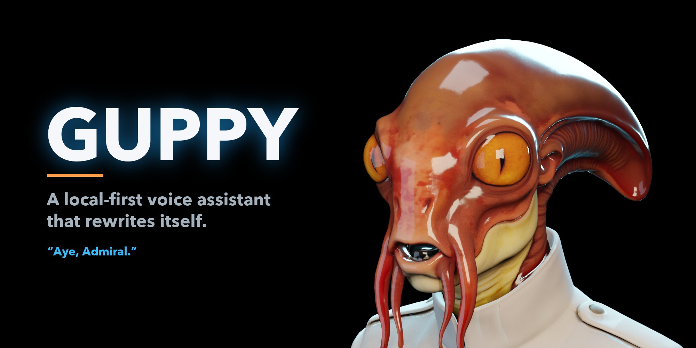
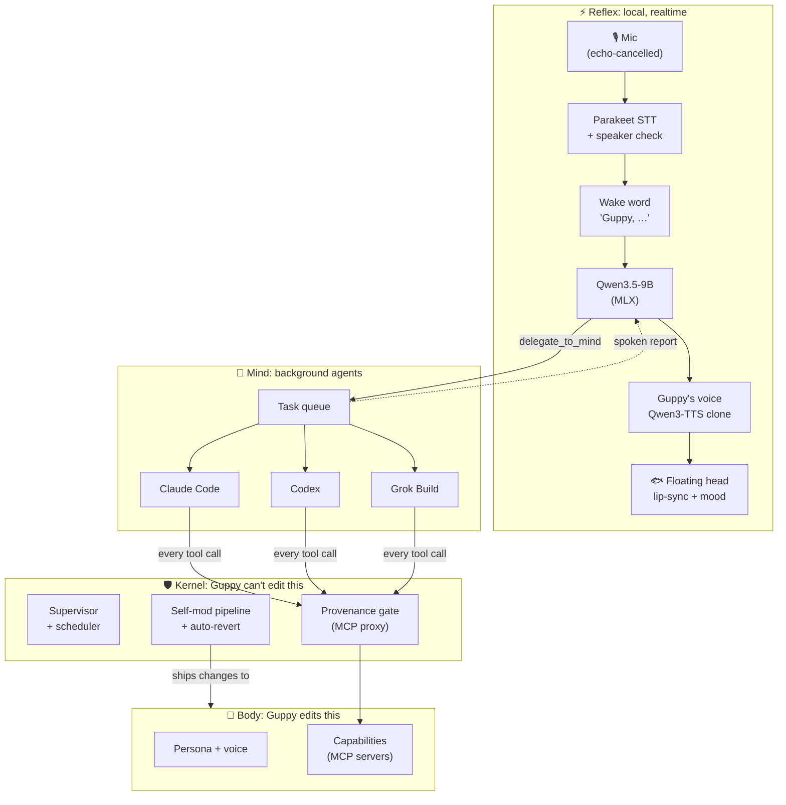
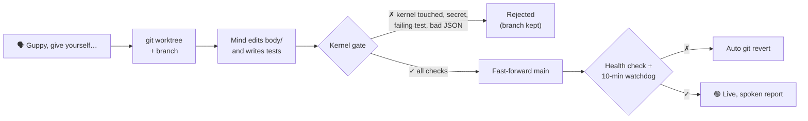

<p align="center">
  
</p>

<p align="center">
  
  
  
  
  
</p>

<p align="center">
  <b>Talk to your Mac. It answers in a voice of its own, does real work in the background,<br>
  and ships improvements to its own code, behind a kernel that tests every change and rolls back the bad ones.</b>
</p>

---

> **Admiral:** Guppy, how does my sprint look?
> **Guppy:** *One moment, Admiral.* … Sprint fifteen has sixty-six items. Eleven are yours, nine still open, none started.
> **Admiral:** Guppy, give yourself a clock.
> **Guppy:** Aye. Scheduling some self-improvement. … *(two minutes later)* Self-modification passed every check and is live.

Guppy is a personal voice assistant named after the ship's AI in Dennis E. Taylor's *Bobiverse*: deadpan,
hyper-competent, and quietly exasperated. It lives as a small floating head on the desktop, listens for its name,
knows its owner's voice, and hands anything hard to a background "Mind" built on the coding-agent CLIs you already
pay for. The part that makes it different: **Guppy extends himself.** Ask for a new ability and he writes it,
tests it, and puts it live, and a kernel he can't touch decides whether it ships.

## ✨ Highlights

<table>
<tr>
<td width="50%" valign="top">

**🎙️ Local, realtime voice**<br>
Speech in and out never leaves the Mac. About **1.4 s** from the end of your sentence to Guppy's voice,
with a short filler line the moment he reaches for a tool so there's no dead air.

</td>
<td width="50%" valign="top">

**🧠 Reflex + Mind**<br>
A fast local model handles conversation; real work (shell, files, web, code, email, DevOps) goes to
**Claude Code, Codex, or Grok** running in the background, on your existing subscriptions.

</td>
</tr>
<tr>
<td valign="top">

**🧬 Self-modification that can't brick him**<br>
Changes happen in a git worktree, pass a kernel-run gate (tests, secret scan, capability handshakes),
fast-forward main, and auto-revert if a 10-minute watchdog sees trouble. "Guppy, undo that" is `git revert`.

</td>
<td valign="top">

**🛡️ Zero approvals, still safe**<br>
Your own requests run autonomously. Anything that has read outside content (an email, a web page, a ticket)
must get your spoken "yes" before it sends, publishes, or changes anything.

</td>
</tr>
<tr>
<td valign="top">

**👂 Wake word + speaker verification**<br>
"Guppy, …" wakes him; he sleeps again as soon as he's answered. After a 30-second enrollment he only listens
to **your** voice, so the TV can't talk to him.

</td>
<td valign="top">

**🐟 A face on your desktop**<br>
A transparent, draggable 3D head that floats above your windows, lip-syncs, blinks, and shows his mood
(deadpan, smug, exasperated, alarmed).

</td>
</tr>
</table>

## 🏗️ How it works



| Layer | What it does | Runs on |
|---|---|---|
| **Reflex** | Conversation, turn-taking, quick tools (time, schedules, status) | Local: Parakeet, Qwen3.5-9B, Qwen3-TTS on MLX |
| **Mind** | Real work: shell, files, web, code, and Guppy's own capabilities | Claude Code / Codex / Grok CLIs, routed by role, with fallback |
| **Kernel** | Supervision, scheduling, the provenance gate, and the self-modification pipeline | Local Python, a launchd service |
| **Body** | Persona, voice, Mind config, and capabilities: everything Guppy may change | Git, edited by Guppy through the pipeline |

### Measured on an M4 Max

| Stage | Time |
|---|---|
| Speech-to-text (Parakeet TDT 0.6B on MLX) | **0.09 s** |
| Reflex LLM, first token (Qwen3.5-9B 4-bit) | **0.27 s** |
| Guppy's voice, first audio (Qwen3-TTS 1.7B clone, streaming) | **0.17 s** |
| **End of your sentence → Guppy speaking** | **≈ 1.4 s** |

## 🧬 Self-modification



The gate never takes the Mind's word for anything: it re-runs the tests itself, scans the diff for secrets, rejects
any change outside `body/`, handshakes every capability over MCP, and puts the live kernel back if an agent tried to
write to it. Capabilities Guppy has built for himself so far:

| Capability | Tools | Built by |
|---|---|---|
| 🕰️ **clock** | local time, any timezone, timezone lookup | Guppy |
| ✉️ **email** | inbox, read, send as `guppy@johnnycode.ai` (own capped Remail key) | Guppy |
| 📋 **devops** | sprint summary, my work items, read/search, update, comment, create | Guppy |
| 📝 **blog** | drafts with generated hero images, publish to johnnycode.ai/blog | Guppy |

## 🛡️ Safety model

Every capability tool declares an effect class, and the kernel's gateway checks every single call:

| | **read** | **draft** | **act** (send, publish, deploy, update) |
|---|---|---|---|
| **Clean task** (only the Admiral's words) | ✅ | ✅ | ✅ after a 15 s hold you can cancel by voice |
| **Tainted task** (read an email, page, or ticket) | ✅ | ✅ | ⏸ held until the Admiral says "yes"; denied on timeout |
| **Kernel unreachable** | ✅ | ❌ | ❌ fails closed |

Confirmation is voice-only by design: there is no HTTP endpoint for it, so a Mind with a shell cannot approve its
own actions. Every decision lands in an audit table.

> [!NOTE]
> The gate governs capability tools. The Mind agents themselves run with broad permissions on your Mac (that's
> the "zero approvals" choice), so treat Guppy like any autonomous agent you let loose on your machine.

## 🚀 Quick start

**Requirements:** an Apple Silicon Mac (tested on an M4 Max, 36 GB), Python 3.12 via `uv`, Xcode command-line
tools, and at least one of the `claude`, `codex`, or `grok` CLIs logged in.

```bash
git clone https://github.com/newtro/Guppy.git && cd Guppy
uv venv --python 3.12 .venv && uv pip install --python .venv -r pyproject.toml

kernel/service.sh install      # run the kernel at login (logs: ~/Library/Logs/Guppy/kernel.log)
pet/build.sh --login           # build the floating head and start it at login
```

The first start downloads about 10 GB of models. Then:

1. **Teach him your voice:** "Guppy, learn my voice," then say five sentences, one at a time.
2. **Talk:** "Guppy, what time is it in Tokyo?" · "Guppy, how does my sprint look?" ·
   "Guppy, every weekday at nine, check your inbox." · "Guppy, give yourself …"
3. **Drag** the head anywhere; **click** it to wake him without the wake word; **right-click** for mute, size,
   and the full view (transcript + live task list) at `http://127.0.0.1:8765`.

> [!IMPORTANT]
> The 3D head model isn't included in this repository. Build your own with the Tripo → Blender pipeline in
> `spikes/avatar/` and place it at `body/avatar/guppy_head.glb`.

## 🗂️ Project layout

```text
kernel/                 Guppy can't edit this
  voice/                Pipecat voice loop, UI, wake word, speaker verification, reflex tools
  mind/                 CLI adapters (Claude Code, Codex, Grok) + task manager
  gate.py, gateway.py   provenance gate and the per-capability MCP proxy
  selfmod.py            worktree → gate → promote → watchdog → revert
  scheduler.py          cron, "every weekday at 9", "in 20m"
  service.sh            launchd service
body/                   Guppy edits this (through the pipeline)
  persona/              system prompt, voice spec, filler lines, wake settings
  mind/                 provider routing, autonomy, gate timings, Mind instructions
  capabilities/         clock, email, devops, blog (MCP servers + tests)
pet/                    GuppyPet.app (Swift): the floating desktop head
spikes/                 avatar rigging and the voice bake-off that picked Guppy's voice
```

## 🎚️ Make him yours

Everything that defines Guppy lives in `body/`, and he can change it himself:

- `body/persona/guppy.md`: who he is and how he talks
- `body/persona/voice/voice.json`: wake phrases, speaker-verification thresholds, the cloned voice
- `body/persona/voice/fillers.json`: what he says while he's thinking
- `body/mind/config.json`: which agent handles which kind of work, gate timings, concurrency

Or just ask: *"Guppy, be a little more sarcastic."* · *"Guppy, stay awake longer after we talk."*

## 🧪 The voice

Guppy's voice was designed, not cloned from a real person. A bake-off on the M4 Max compared Qwen3-TTS, Breeze TTS 2,
and VoxCPM2. Breeze designed the voice (older, gravelly, a little weary), and Qwen3-TTS clones that reference live
because it's the only one fast enough to stream (**0.11 s** to first audio). See `spikes/voice/`.

## 🗺️ Status

Working today: voice loop, floating head, wake word, speaker verification, the Mind across three providers,
self-modification with auto-revert, the provenance gate, the scheduler, and the email, DevOps, and blog capabilities.

Next up: a trained acoustic wake word, a global push-to-talk hotkey, spoken emotion (not just the face), and
running the Mind under its own macOS user for real sandboxing.

## 🙏 Acknowledgements

- *Guppy* and the *Bobiverse* are the creation of **Dennis E. Taylor**. This is an unaffiliated fan project.
- Built on [Pipecat](https://github.com/pipecat-ai/pipecat), [MLX](https://github.com/ml-explore/mlx),
  [mlx-audio](https://github.com/Blaizzy/mlx-audio), [parakeet-mlx](https://github.com/senstella/parakeet-mlx),
  [sherpa-onnx](https://github.com/k2-fsa/sherpa-onnx), and [Three.js](https://threejs.org).
- Architecture, kernel, and voice loop were built with [Claude Code](https://claude.com/claude-code). Several
  capabilities were written by Guppy himself.

No license has been chosen yet. Until one is added, all rights are reserved.

<p align="center"><i>"Aye, Admiral."</i></p>
